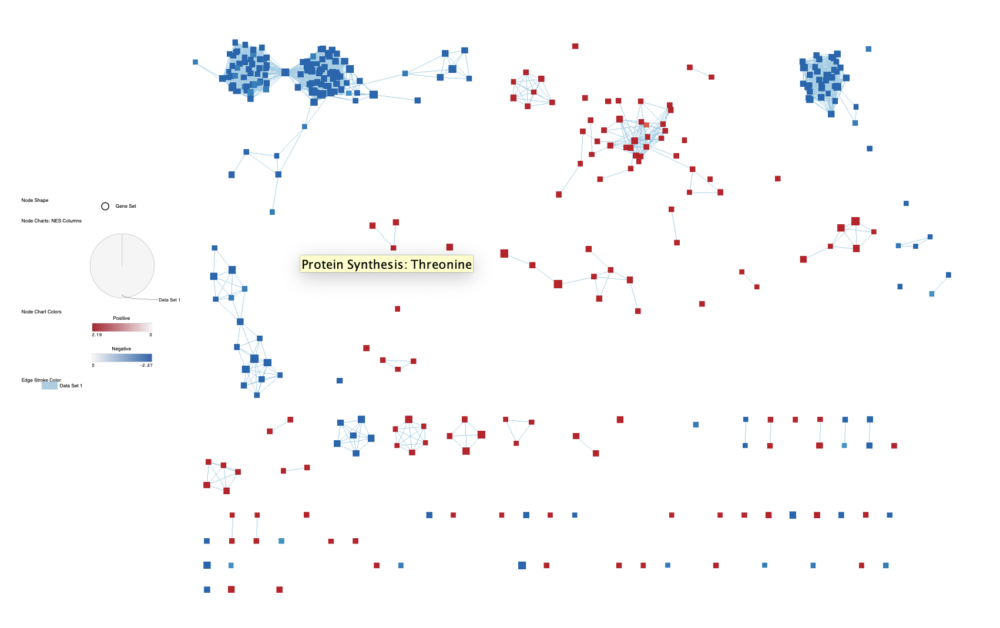

[@durinck2009a]
[@durinck2005a]
[@davis2007a]
[@huber2015a]
[@r]
[@sanghi2021a]
[@law2016a]
[@robinson2010a]
[@mccarthy2012a]
[@chen2016a]
[@mccarthy2012a]
[@morgan2021a]
[@kolberg2020a]
[@gu2016a]

# Introduction 
The data set I selected from GEO (Gene Expression Omnibus) was "APOE4 Causes Widespread Molecular and Cellular Alterations Associated with Alzheimer's Disease Phenotypes in Human iPSC-Derived Brain Cell Types" conducted by the lab in MIT on Illumina HiSeq 2000 platform with GEO identifier GSE102956. This research compares the three controls(APOE3) and three tests(APOE4) iPSC-Derived Brain Cell to find whether APOE4 variant of APOE gene will cause Alzheimer's Disease. \
In the first part of the assignment, the data set was first cleaned by checking duplication and removing the low gene counts and outliers. Then the mixed NCBI gene ids and HGNC ids are merged and mapped into HGNC id. Finally, the data was normalized by TMM to be better used in the future.\
In the second part of the assignment, we calculate the differential expression of the genes by categorizing them into two types, test and control. Then, we calculate their differential p value to find the significantly differentiated genes and identify them being up-ragulated ot down-regulated through their fold change. Finally, we use G:profiler a thresholded gene set enrichment analysis to see the pathways where these significantly differentiated up-regulated genes and down-regulated genes are participate in. \
In the third part of the assignment, we will run a non-thresholded gene set enrichment analysis with GSEA and visualize the result with Cytoscape and analysis these pathways.  

# Non-thresholded Gene set Enrichment Analysis

### Run GSEA
We run the non-thresholded Gene set Enrichment Analysis with GSEA program (4.3.2) [@subramanian2005gene]. The gene set database we use is the Human_GOBP_AllPathways_no_GO_iea_March_02_2023_symbol from Bader lab. The ranked gene list are generated in assignment 2 with all genes ranked by their fold_change times significance. \
```{r img-with-knitr, fig.align='center', out.width='100%', fig.cap='Run GSEA on Pre-ranked Gne List Panel'}

```

### Result
The result returned by GSEA is as following. \
-3016 / 5126 gene sets are up-regulated \
-733 gene sets are significant at FDR < 25%\
-339 gene sets are significantly enriched at nominal p-value < 1%\
-691 gene sets are significantly enriched at nominal p-value < 5% \
-The top pathway is CADHERIN SIGNALING PATHWAY with NOM p-value of 0.000\
```{r, fig.align='center', out.width='100%', fig.cap='Geneset Enriched Positive Top20'}

```

2110 / 5126 gene sets are down-regulated\
737 gene sets are significantly enriched at FDR < 25%\
335 gene sets are significantly enriched at nominal pvalue < 1%\
601 gene sets are significantly enriched at nominal pvalue < 5%\
-The top pathway is MITOCHONDRIAL TRANSLATION INITIATION with NOM p-value of 0.000\
```{r, fig.align='center', out.width='100%', fig.cap='Geneset Enriched Negative Top20'}

```

### Comparison
Compare the results from Non-thresholded enrichment analysis with GSEA to threshholded enrichment analysis with G:profiler.\ 

In the result from G:profiler, there are 82 pathways with p-value <= 0.05 in the significantly differentiated up-ragualted genes. In the result form GSEA, there are 691 pathways with p-value <= 0.05 are up-regualted.\ 
In the result from G:profiler, there are 3 pathways with p-value <= 0.05 in the significantly differentiated up-ragualted genes. In the result form GSEA, there are 601 pathways with p-value <= 0.05 are down-regualted.\ 

If we compare the two methods quality wise, even though the number of pathways returned by GSEA are significantly more than G:profiler, the overall quality of the results are both promising. The reason why GSEA returns more pathways than G:profiler is that GSEA analysis also include the genes that are not significantly differentiated in the tests and controls. Thus, these non-significantly differentiated genes will compose more pathways together with significantly differentiated genes in both up and down regulated genes.\ 

Since we are interested in the Alzheimer's disease target genes and pathways, thus we are more interested in the pathways that are related to neural transmitting. The top result from GSEA up-regulated genes is CADHERIN SIGNALING PATHWAY which is the pathway that highly involved in cell-cell interactions such as neural signal transmitting. The top result form G:profiler up-regulated genes is neuron migration, which is also highly involved in neurons. \ 

These two method are both insightful in enrichment analysis. However, this is not a straight forward comparison. As I mentioned above, GSEA analysis also include the genes that are not significantly differentiated in the tests and controls, while G:profiler only consider genes that are significantly differentiated. In other words, these two methods are performed on the same foundation. 

# Visualize your Gene set Enrichment Analysis in Cytoscape
### Visualization 
Use Enrichment map app in Cytoscape to visualize the results generated by GSEA.\
In network, there are 482 nodes, 4387 egdes. \
The parameters that I used are q-value node cutoff = 0.05 and edge cut-off = 0.5 

```{r, fig.align='center', out.width='100%', fig.cap='Publication Ready Figure '}

```


```{r, fig.align='center', out.width='100%', fig.cap='Big Up-regulated Cluster in EM '}

```

```{r, fig.align='center', out.width='100%', fig.cap='Big Down-regulated Cluster in EM '}

```

### Annotate the network with AutoAnnotate app.  
```{r, fig.align='center', out.width='100%', fig.cap='AutoAnnotate Network'}

```
```{r, fig.align='center', out.width='100%', fig.cap='AutoAnnotate Parameters '}

```

### Collapse your network to a theme network
```{r, fig.align='center', out.width='100%', fig.cap='Collapsed Network'}

```

# Interpretation and detailed view of results

I chose the SYNAPSE ORGANIZATION pathway [GO:0050808](https://www.ebi.ac.uk/QuickGO/term/GO:0050808) to investigate more detail, because this pathways is up-regulated in the test group, which aligns with the discoveries in the paper. And more importantly, this pathway contains the APOE gene which is the center of our analysis. According to GO, "this pathway is carried out at the cellular level which results in the assembly, arrangement of constituent parts, or disassembly of a synapse, the junction between a neuron and a target (neuron, muscle, or secretory cell)." In the original paper where these RNASeq data was published. Researchers observed increased miniature excitatory postsynaptic current (mEPSC) frequencies with indistinguishable mEPSC amplitudes in APOE4 neurons compared to APOE3 controls suggesting increased release of neurotransmitter or elevated synaptic density in APOE4 neurons.[@lin2018apoe4]  And "increased synaptic activity has been shown to correlate with increased Ab production"[@bero2011neuronal]. Ab production is believed to be one of the the causes of Alzheimer's disease. Therefore, the up-regulation of SYNAPSE ORGANIZATION pathway potentially caused by APOE4 gene variant can  feasibly increase the synapses density causing Ab elevation thus contributing to the  Alzheimer's disease, which is essentially what we are discovering in this assignment.   
  
The depth of colour are determined by ranked value. 
```{r, fig.align='center', out.width='100%', fig.cap='Gene Network by GeneMANIA'}

```
# Conclusion 

As I demonstrated in the third part of the assignment, the GSEA returned a very promising result that strongly support the mechanisms discussed in the original paper. GSEA result showed that the APOE4 (test groups) variant genes demonstrates an up-regulation of synapse related pathways. And in the paper, researchers also discovered elevation of synaptic density in APOE4 neurons, which has been shown to correlate with increased Ab production [@lin2018apoe4]. And Ab production is believed to be one of the the causes of Alzheimer's disease [@bero2011neuronal]. This is essentially what we are discovering in this assignment: The correlation between APOE4 and the Alzheimer's disease. \

If we compare the result from G:profiler and GSEA, even though the number of pathways returned by GSEA are significantly more than G:profiler, the overall quality of the results are both promising. The reason why GSEA returns more pathways than G:profiler is that GSEA analysis also include the genes that are not significantly differentiated in the tests and controls. Thus, these non-significantly differentiated genes will compose more pathways together with significantly differentiated genes in both up and down regulated genes.\ 

Since we are interested in the Alzheimer's disease target genes and pathways, thus we are more interested in the pathways that are related to neural transmitting. The top result from GSEA up-regulated genes is CADHERIN SIGNALING PATHWAY which is the pathway that highly involved in cell-cell interactions such as neural signal transmitting. The top result form G:profiler up-regulated genes is neuron migration, which is also highly involved in neurons. \ 

These two method are both insightful in enrichment analysis. However, this is not a straight forward comparison. As I mentioned above, GSEA analysis also include the genes that are not significantly differentiated in the tests and controls, while G:profiler only consider genes that are significantly differentiated. In other words, these two methods are performed on the same foundation. 

# Reference 